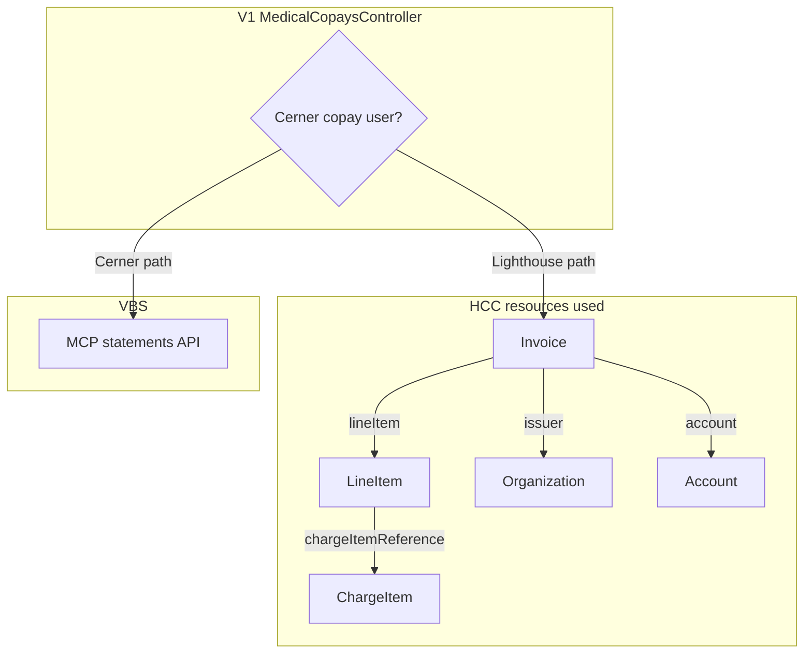
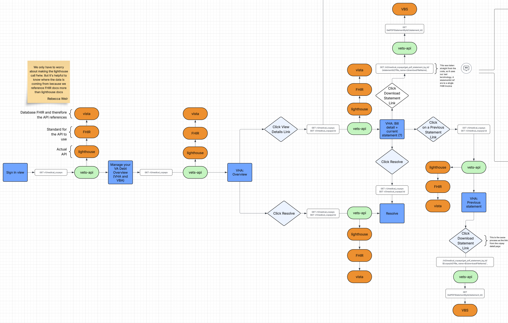

# Medical Copays — Backend Architecture

This describes how **FHIR (via Lighthouse Healthcare Cost & Coverage)**, **Lighthouse API orchestration**, and **VBS** relate to what clients see on **`/v1/medical_copays`**, **`/v1/medical_copays/summary`**, and **`/v1/medical_copays/{id}`**. Swagger lives in `app/swagger/swagger/v1/requests/medical_copays.rb`; the v1 controller is `app/controllers/v1/medical_copays_controller.rb`.

---

## Table of Contents

- [Medical Copays — Backend Architecture](#medical-copays--backend-architecture)
  - [Table of Contents](#table-of-contents)
  - [Definitions](#definitions)
    - [VA API \& Routing](#va-api--routing)
  - [Architecture Overview](#architecture-overview)
    - [Data Stack](#data-stack)
    - [API Layer](#api-layer)
    - [Two Response Families (Union Contract)](#two-response-families-union-contract)
  - [High-Level Flow](#high-level-flow)
  - [Low-Level Flow](#low-level-flow)
  - [Endpoints](#endpoints)
    - [`GET /v1/medical_copays` — Lighthouse branch (`isCerner: false`)](#get-v1medical_copays--lighthouse-branch-iscerner-false)
    - [`GET /v1/medical_copays/summary`](#get-v1medical_copayssummary)
    - [`GET /v1/medical_copays/{id}` — Lighthouse branch (`isCerner: false`)](#get-v1medical_copaysid--lighthouse-branch-iscerner-false)
      - [Resource wrapper (`data`)](#resource-wrapper-data)
      - [Top-level `attributes` (`data.attributes`)](#top-level-attributes-dataattributes)
      - [Nested `lineItems`](#nested-lineitems)
      - [`associatedStatements` / `associatedInvoices` — `chargeItems[]`](#associatedstatements--associatedinvoices--chargeitems)
      - [`payments[]`](#payments)
  - [Frontend Contract Matrix](#frontend-contract-matrix)
  - [Where `cerner_facility_ids` Comes From](#where-cerner_facility_ids-comes-from)
  - [References](#references)
    - [FHIR Resource Links](#fhir-resource-links)
    - [Codebase](#codebase)

---

## Definitions

### VA API & Routing

| Term | Meaning |
|------|---------|
| **FHIR** | HL7 healthcare JSON wire format; Lighthouse **`r4/...`** endpoints use `Accept: application/json+fhir`. FHIR is a **standard**, not a server — it defines how healthcare data is shaped and queried. |
| **HCC** | **Healthcare Cost & Coverage** — the Lighthouse product we consume; clients live in `lib/lighthouse/healthcare_cost_and_coverage/`. |
| **ICN** | Integration Control Number — veteran identity token used as the `patient` parameter and for token launch on HCC. |
| **VBS / MCP** | Vista Billing via `Settings.mcp.vbs_v2` — flat `pS*` / `pH*` payloads, not FHIR. |
| **Lighthouse** | The VA's FHIR R4 implementation, sitting in front of legacy VistA backend systems. It is the only FHIR server in this stack — there is no separate FHIR endpoint to call directly. |

---

## Architecture Overview

### Data Stack

The VA exposes veteran healthcare cost data through **Lighthouse**, which sits in front of the legacy **VistA** backend systems and surfaces that data via **FHIR R4** endpoints. Our application consumes Lighthouse through the **Healthcare Cost & Coverage (HCC)** API, which exposes FHIR R4 resources such as `Invoice`, `ChargeItem`, `Account`, `Organization`, and `Patient` under paths like `r4/Invoice`. The entry point on our side is `lib/lighthouse/healthcare_cost_and_coverage/invoice/service.rb`.

Raw FHIR bundles are never returned verbatim to clients. The service class `MedicalCopays::LighthouseIntegration::Service` orchestrates calls across multiple FHIR resources and maps them into domain objects before serialization.

### API Layer

Two serializers handle the outward-facing response shape:

| Serializer | Endpoint | JSON:API Type |
|---|---|---|
| `Lighthouse::HCC::InvoiceSerializer` | index, summary | `medical_copays` |
| `Lighthouse::HCC::CopayDetailSerializer` | show | `medical_copay_details` |

### Two Response Families (Union Contract)

Swagger documents a **union** for the **index** and **show** routes: either a JSON:API-oriented **Lighthouse / HCC** payload or a flat **VBS** payload. The discriminator is top-level **`isCerner`**.

| Swagger Shape | Backend Path | Primary Services |
|---|---|---|
| `isCerner: false`, JSON:API `data` (+ optional `meta`, links) | Lighthouse integration | `MedicalCopays::LighthouseIntegration::Service` → `Lighthouse::HCC::*Serializer` |
| `isCerner: true`, flat `pS*` / `pH*` statement fields | VBS | `MedicalCopays::VBS::Service` → `ResponseData` |

**`GET /v1/medical_copays/summary`** is **not** part of this union: the controller always calls `MedicalCopays::LighthouseIntegration::Service#summary` and renders `InvoiceSerializer` **without** merging `isCerner` (Lighthouse-only; matches Swagger).

**Implementation note:** `#index` and `#show` branch on `cerner_copay_user?` (`MedicalCopays::CernerFacilities.cerner_copay_user?`) to choose VBS vs Lighthouse. **`summary` has no Cerner/VBS branch** — it never routes to VBS.

---

## High-Level Flow

Diagram shows only **HCC resources we actually request** in this integration. `CernerFacilities` chooses VBS vs this path; it is not a FHIR call.

---

## Low-Level Flow

[Edit in Lucidchart](https://lucid.app/lucidchart/0084c551-a515-4e61-b5e2-c9c1457abcd4/edit?viewport_loc=-2149%2C-627%2C4657%2C2372%2C0_0&invitationId=inv_2b692e0f-9a8a-42e6-b79e-7d7b8d11f4b0)

---

## Endpoints

Each endpoint section covers two things: **resource calls** — what we fetch from Lighthouse and why — and **attribute mapping** — how that data is shaped into the API response.

---

### `GET /v1/medical_copays` — Lighthouse branch (`isCerner: false`)

**Resource Calls**

We search `r4/Invoice` scoped to the veteran's ICN. Each `Invoice` in the response bundle already includes nested `lineItem` JSON — including `chargeItemReference` — so we read that embedded data directly without making additional `ChargeItem` API calls.

| Resource | Call | Why |
|---|---|---|
| `Invoice` | `GET r4/Invoice?patient={ICN}` | Root list of bills |
| `Organization` | `GET r4/Organization/{id}` (per invoice) | City and facility name from `Invoice.issuer` |

<strong>Attribute Mapping</strong>

Controller: `InvoiceSerializer.new(invoice_bundle.entries, links:, meta:).serializable_hash.merge(isCerner: false)`

| Swagger / JSON Area | Code | FHIR / Source |
|---|---|---|
| **`isCerner`** | Controller merge | Not FHIR; literal `false` on this branch |
| **`status`** | — | Not set on the Lighthouse branch; appears only on the VBS branch (`ResponseData#handle`) |
| **`data`** | JSON:API `data` array from `InvoiceSerializer` | Each element corresponds to one `Bundle.entry` whose `resource` is an `Invoice` |
| **`data[].id`** | `set_id :external_id` → `Invoice#external_id` | `Invoice.id` |
| **`data[].type`** | `medical_copays` | JSON:API discriminator |
| **`data[].attributes.externalId`** | `Invoice#external_id` | `Invoice.id` |
| **`data[].attributes.facility`** | `Invoice#facility` | `Invoice.issuer.display` |
| **`data[].attributes.facilityId`** | `Invoice#facility_id` | Issuer `Organization` logical id, parsed from `Invoice.issuer.reference` and enriched in `build_invoice_entries` |
| **`data[].attributes.city`** | `Invoice#city` | `Organization.address.city` (from `retrieve_organization_address`) |
| **`data[].attributes.invoiceDate`** | `Invoice#invoice_date` | `Invoice.date` |
| **`data[].attributes.latestBillingRef`** | `Invoice#latest_billing_ref` | Last segment of `Invoice.lineItem[0].chargeItemReference.reference` |
| **`data[].attributes.currentBalance`** | `Invoice#current_balance` (`calculate_current_balance`) | Sum of `Invoice.totalPriceComponent` amounts where `type` ≠ `informational` |
| **`data[].attributes.previousBalance`** | `Invoice#previous_balance` | `Invoice.totalPriceComponent` entry with `type: informational` and `code.text: "Original Amount"` |
| **`data[].attributes.previousUnpaidBalance`** | `Invoice#previous_unpaid_balance` | Sum of `Invoice.totalPriceComponent` amounts where `type` is `base` or `surcharge` |
| **`data[].attributes.lastUpdatedAt`** | `Invoice#last_updated_at` | `Invoice.meta.lastUpdated` |
| **`data[].attributes.url`** | `Invoice#url` (`@params.dig('resource', 'fullUrl')`) | `Bundle.entry.fullUrl` for that entry |
| **`links`** | `Lighthouse::HCC::Bundle#build_links` | Derived from `Bundle.link` (`self`, `first`, `next`, …); URLs rewritten to vets-api host |
| **`meta`** | `Bundle#build_meta` + `copay_summary_meta` | `Bundle.total` from FHIR; `page` / `per_page` parsed from the `self` link query. `copay_summary` (`total_current_balance`, `copay_bill_count`, `last_updated_on`) is computed in Ruby from the resolved `Invoice` list |

---

### `GET /v1/medical_copays/summary`

**Resource Calls**

Uses the same `Invoice` list logic as index, filtered to a date window (`Invoice.date >= N months ago`). No additional resource calls beyond what the list makes. `data` is always an empty array — all output is in `meta`.

<strong>Attribute Mapping</strong>

Controller: `render json: InvoiceSerializer.new(result[:entries], meta: result[:meta])` — no `isCerner`, no `links`. `data` is always an empty array; all meaningful output is in `meta`.

| Query / JSON Area | Code | FHIR / Source |
|---|---|---|
| **`months`** (query param) | `month_count: params[:months]&.to_i || 6` → `Service#summary(month_count:)` | Window filter: `Invoice.date >= month_count.months.ago` inside `collect_invoices_in_range` (same core collection as index’s `list_months`, which also defaults to a 6‑month window when not overridden) |
| **`data`** | `InvoiceSerializer` with `entries: []` | Always empty — schema items match index `data[]` for tooling only |
| **`meta.total_amount_due`** | Sum of `Invoice#current_balance` over filtered entries | Same `current_balance` rule as index (`Invoice.totalPriceComponent`, non-informational amounts) |
| **`meta.total_copays`** | Count of filtered entries | Count of `Invoice` resources in the date window |
| **`meta.month_window`** | Echoes `month_count` | Integer passed into `#summary` (query `months` or default `6`) |

---

### `GET /v1/medical_copays/{id}` — Lighthouse branch (`isCerner: false`)

**Resource Calls**

Handled by `#build_copay_detail` in `app/models/lighthouse/hcc/copay_detail.rb`.

| Resource | Why |
|---|---|
| `Invoice` | Root document — line items, totals, issuer, account reference |
| `Account` | Loaded when the invoice links one — billing account context (`Invoice.account.reference`) |
| `ChargeItem` | Full resources fetched for each `lineItem.chargeItemReference` |
| `Patient` | Fetched by ICN — name and address for the patient block |
| `PaymentReconciliation` | Payment history against this invoice |
| `Encounter` | Linked via `ChargeItem.context` — provides service provider / facility name |
| `MedicationDispense` | Linked via `ChargeItem.service` — medication context for Rx copays |
| `Medication` | Linked via `MedicationDispense` — drug identity |

`Encounter`, `MedicationDispense`, and `Medication` are conditionally loaded — only when a `ChargeItem` points to them.

**Note on batching:** Lighthouse does not support FHIR batch bundle reads (`POST r4` with `Bundle.type: batch`) or `_include` parameters on this API. `ChargeItem` resources are therefore fetched individually per line item reference.

<strong>Attribute Mapping</strong>

Controller: `CopayDetailSerializer.new(copay_detail).serializable_hash.merge(isCerner: false)`

#### Resource wrapper (`data`)

| Field | Code | FHIR / Notes |
|---|---|---|
| **`isCerner`** | Controller merge | Not FHIR |
| **`data.id`** | `set_id :external_id` | `Invoice.id` |
| **`data.type`** | `medical_copay_details` | JSON:API |
| **`data.meta`** | `CopayDetailSerializer` meta block | Derived: `line_items.size`, `payments.size` → `line_item_count` / `payment_count` |

#### Top-level `attributes` (`data.attributes`)

| Attribute | Code (`CopayDetail`) | FHIR |
|---|---|---|
| **`externalId`** | `@invoice_data['id']` | `Invoice.id` |
| **`billNumber`** | `@invoice_data.dig('identifier', 0, 'value')` | `Invoice.identifier` |
| **`status`** | `@invoice_data['status']` | `Invoice.status` |
| **`statusDescription`** | `@invoice_data.dig('_status', 'valueCodeableConcept', 'text')` | `Invoice._status` VA extension |
| **`invoiceDate`** | `@invoice_data['date']` | `Invoice.date` |
| **`paymentDueDate`** | `calculate_payment_due_date` | Computed: `Invoice.date` + 30 days (`PAYMENT_DUE_DAYS`); not a FHIR field |
| **`accountNumber`** | `@account_data&.dig('identifier', 0, 'value')` | `Account.identifier` (loaded via `Invoice.account.reference`) |
| **`originalAmount`** | `find_amount(totalPriceComponent, 'Original Amount')` | `Invoice.totalPriceComponent` (`code.text` match) |
| **`principalBalance`** | `… 'Principal Balance'` | Same |
| **`interestBalance`** | `… 'Interest Balance'` | Same |
| **`administrativeCostBalance`** | `… 'Administrative Cost Balance'` | Same |
| **`principalPaid`** | `… 'Principal Paid'` | Same |
| **`interestPaid`** | `… 'Interest Paid'` | Same |
| **`administrativeCostPaid`** | `… 'Administrative Cost Paid'` | Same |
| **`facility`** | `issuer.display` + `build_facility_address` | `Invoice.issuer` + `Organization.address` |
| **`patient`** | `build_patient_info` | `Patient.name`, `Patient.address` (Patient bundle read by ICN) |
| **`lineItems`** | `assign_line_items` → `build_line_item` per `Invoice.lineItem` | See nested table below |
| **`associatedStatements`** | `assign_associated_statements` | Other `Invoice` resources filtered/sorted in `sorted_invoices`; each row includes `line_items` / `charge_items` built like the main invoice |
| **`associatedInvoices`** | `assign_associated_invoices` | Same underlying invoices; different shaping |
| **`payments`** | `assign_payments` → `build_payment` | `PaymentReconciliation` resources filtered to this invoice |

#### Nested `lineItems`

Also applies to line arrays under `associatedStatements` / `associatedInvoices`.

| Attribute | Code | FHIR |
|---|---|---|
| **`billingReference`** | ChargeItem id from `chargeItemReference` | `ChargeItem.id` |
| **`datePosted`** | `extract_date_posted` | `ChargeItem.occurrenceDateTime`, `occurrencePeriod.start`, or `enteredDate` |
| **`description`** | `charge_item.dig('code', 'text')` | `ChargeItem.code.text` |
| **`providerName`** | `extract_provider_name` → Encounter | `Encounter.serviceProvider.display` (Encounter from `ChargeItem.context`) |
| **`priceComponents[]`** | `build_price_components` | `Invoice.lineItem[].priceComponent` → `type`, `code.text`, `amount.value` |
| **`medication`** (optional) | `build_medication` | `MedicationDispense` + `Medication` via `ChargeItem.service` references |

#### `associatedStatements` / `associatedInvoices` — `chargeItems[]`

Populated from enriched `ChargeItem` JSON attached to sibling invoices in `MedicalCopays::LighthouseIntegration::Service#map_charge_item`: `id`, `meta.lastUpdated`, `status`, `code.text`, `occurrenceDateTime`, `enteredDate` — serialized to `lastUpdatedAt`, `code`, etc.

#### `payments[]`

| Attribute | Code | FHIR |
|---|---|---|
| **`paymentId`** | `payment_data['id']` | `PaymentReconciliation.id` |
| **`paymentDate`** | `payment_data['paymentDate']` | `PaymentReconciliation.paymentDate` |
| **`paymentAmount`** | `payment_data.dig('paymentAmount', 'value')` | `PaymentReconciliation.paymentAmount` |
| **`transactionNumber`** | Identifier where `type.text` is `"Transaction Number"` | `PaymentReconciliation.identifier` |
| **`billNumber`** | Identifier where `type.text` is `"Bill Number"` | `PaymentReconciliation.identifier` |
| **`invoiceReference`** | Extension URL containing `allocation.target` | `PaymentReconciliation.extension` → reference to `Invoice` |
| **`disposition`** | `payment_data['disposition']` | `PaymentReconciliation.disposition` |
| **`detail[]`** | `build_payment_detail` | `PaymentReconciliation.detail` (`type.text`, `amount.value`) |

---

## Frontend Contract Matrix

| UI Element | API JSON Path | Backend Source | Frontend Rendering | Fallback | Risk Level |
|---|---|---|---|---|---|
| StatementTable - Billing Reference | `attributes.billNumber` | `Invoice.identifier` (type "Bill Number") | Rendered per row | `—` | **HIGH** — typed identifier lookup critical |
| StatementTable - Date | `attributes.lineItems[].datePosted` | `ChargeItem` occurrence / entered date | Formatted via `formatDate()` | `—` | LOW |
| StatementTable - Description | `attributes.lineItems[].description` | `ChargeItem.code.text` | Bold text; rows filtered if `&nbsp;`-prefixed; provider/Rx/supply info as secondary lines | `—` | MEDIUM — filtering relies on consistent data |
| StatementTable - Amount | `attributes.lineItems[].priceComponents[0].amount` | `Invoice.lineItem.priceComponent[0].amount.value` | Currency formatted via `formatCurrency()` | `$0.00` | MEDIUM — only first component taken |
| Detail - Current Balance | `attributes.principalBalance` | `Invoice.totalPriceComponent` (Principal Balance) | Currency formatted | `$0.00` | LOW |
| Detail - Payment Due | `attributes.paymentDueDate` | Computed: `invoice_date` + 30 days | Formatted via `formatDate()` | None | MEDIUM — computation critical |
| Detail - New Charges | `attributes.principalPaid` | `Invoice.totalPriceComponent` (Principal Paid) | Currency formatted; only shown when `lineItems` is empty | `$0.00` | LOW |
| Detail - Account Number | `attributes.accountNumber` | `Account.identifier[0].value` | Formatted via `splitAccountNumber()` | Empty | LOW |
| Detail - Facility Title | `attributes.facility.name` | `Invoice.issuer.display` | Page title: "Copay bill for [name]" | "Copay bill" | LOW |
| Detail - Facility Address | `attributes.facility.address` | `Organization.address` (via lookup) | Address block | None | LOW |
| Patient Block | `attributes.patient.firstName/middleName/lastName/address` | `Patient` bundle first entry | Name + address on statement detail | None | LOW |
| Previous Statements | `attributes.associatedStatements[]` | Filtered/grouped/sorted `Invoice` array | Statement row links with date + bill number | None | MEDIUM — sort order/grouping critical for UX |

---

## Where `cerner_facility_ids` Comes From

This is documented here because `cerner_facility_ids` is what determines whether a veteran hits the Lighthouse path or the VBS path — it is the gate behind the `isCerner` discriminator in the Two Response Families section above. These IDs are **not** from FHIR `Invoice` or Lighthouse; they come from MPI and live on the user session.

The population chain is:

1. `MPI::Responses::ProfileParser` sets `cerner_facility_ids` from `parsed_mvi_ids[:cerner_facility_ids]` (`lib/mpi/responses/profile_parser.rb`)
2. `parsed_mvi_ids` comes from `Identity::Parsers::GCIds` (`lib/identity/parsers/gc_ids.rb`), which walks MPI `identifier` extensions under the VA root OID
3. Identifiers whose extension text matches `CERNER_FACILITY_IDS_REGEX` (pattern like `…^PI^…^USVHA^C`) are treated as facility IDs; the parser takes the `assigning_facility` field from the HL7 II-style token (see `gc_ids_constants.rb`)

---

## References

### FHIR Resource Links

| Resource | HL7 FHIR R4 |
|---|---|
| Invoice | [Invoice](https://hl7.org/fhir/R4/invoice.html) |
| ChargeItem | [ChargeItem](https://hl7.org/fhir/R4/chargeitem.html) |
| Account | [Account](https://hl7.org/fhir/R4/account.html) |
| Organization | [Organization](https://hl7.org/fhir/R4/organization.html) |
| Patient | [Patient](https://hl7.org/fhir/R4/patient.html) |
| Encounter | [Encounter](https://hl7.org/fhir/R4/encounter.html) |
| MedicationDispense | [MedicationDispense](https://hl7.org/fhir/R4/medicationdispense.html) |
| Medication | [Medication](https://hl7.org/fhir/R4/medication.html) |
| PaymentReconciliation | [PaymentReconciliation](https://hl7.org/fhir/R4/paymentreconciliation.html) |
| Bundle | [Bundle](https://hl7.org/fhir/R4/bundle.html) |

For VA API platform docs (sandbox, auth, constraints): [developer.va.gov — Health Care Costs & Coverage](https://developer.va.gov/explore/api/health-care-costs-coverage)

### Codebase

| File | Purpose |
|---|---|
| `app/swagger/swagger/v1/requests/medical_copays.rb` | Swagger (v1) |
| `app/swagger/swagger/requests/medical_copays.rb` | Swagger (v0 VBS) |
| `app/controllers/v1/medical_copays_controller.rb` | V1 controller |
| `app/services/medical_copays/lighthouse_integration/service.rb` | Lighthouse integration orchestrator |
| `app/models/lighthouse/hcc/copay_detail.rb` | Detail builder (`build_copay_detail`) |
| `lib/lighthouse/healthcare_cost_and_coverage/` | HCC clients |
| `app/services/medical_copays/vbs/service.rb` | VBS service |